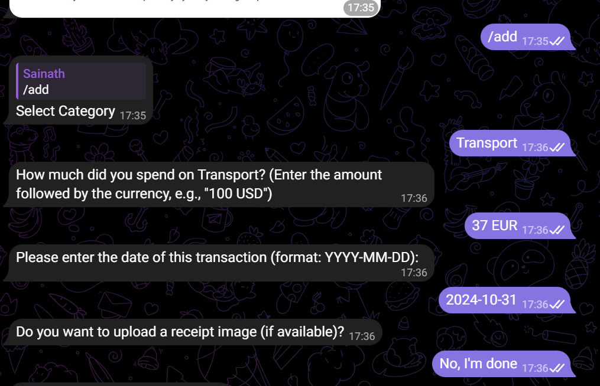

### 2. **multi_currency.md**



```markdown
# Multi-Currency Feature

## Overview
TrackMyDollar’s multi-currency feature allows you to track expenses and income in various currencies. This is especially useful for users who frequently travel or handle transactions in different currencies.

## How to Use the Multi-Currency Feature

1. **Adding a Transaction in a Different Currency**:
   - To add an expense or income in a specific currency, use the `/add` or `/income` command, followed by the amount, currency code, category, and description.
   - Supported currency codes include USD, EUR, INR, GBP, and others as per ISO currency standards.

2. **Automatic Conversion**:
   - The bot converts all transactions into a base currency (e.g., USD) for consistent reporting.
   - When viewing summaries or reports, all values will be displayed in the base currency.

3. **Setting a Base Currency** (optional):
   - You can set your preferred base currency by using the `/setbase <currency_code>` command.
   - Example: `/setbase USD`

## Example Commands

- **Adding an Expense in EUR**:
  ```plaintext
  /add 50 EUR Travel "Train ticket in Europe"
